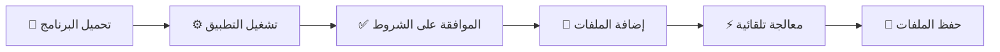
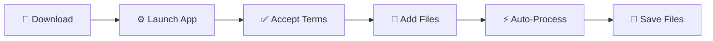

<div align="center">

#  Office Protection Remover 

### 🔓 The Ultimate Security Stripper for Microsoft Office Suite 🔓

#### *One Tool. All Protections. Zero Hassle.*

<p>
  
  
  
  
</p>

<p>
  
  
  
  
</p>

---

### ✨ *Remove Protection from ANY Office File in Seconds* ✨

</div>

---

<div align="center">
  
  <a href="#arabic"></a>&nbsp;&nbsp;&nbsp;
  <a href="#english"></a>
  
</div>

---

<!-- ======================== ARABIC SECTION ======================== -->
<div id="arabic" dir="rtl">

# <div align="center">🇸🇦 العربية</div>

<div align="center">
  
  
  
  <br><br>
  
  <h2>⚡ أقوى أداة لإزالة حماية ملفات الأوفيس دفعة واحدة ⚡</h2>
  
  <p>
    
  </p>
  
</div>

---

## 📋 المحتويات

<table dir="rtl">
  <tr>
    <td align="center"><a href="#overview-ar">📌 نظرة عامة</a></td>
    <td align="center"><a href="#features-ar">✨ المميزات</a></td>
    <td align="center"><a href="#download-ar">📥 التحميل</a></td>
    <td align="center"><a href="#usage-ar">🚀 الاستخدام</a></td>
   </tr>
   <tr>
    <td align="center"><a href="#formats-ar">🎛️ الصيغ المدعومة</a></td>
    <td align="center"><a href="#protection-ar">🔒 أنواع الحماية</a></td>
    <td align="center"><a href="#comparison-ar">📊 مقارنة</a></td>
    <td align="center"><a href="#disclaimer-ar">⚠️ إخلاء مسؤولية</a></td>
   </tr>
</table>

---

<div id="overview-ar"></div>

## 📌 نظرة عامة

<div style="background: linear-gradient(135deg, #1a1a2e 0%, #16213e 100%); padding: 25px; border-radius: 15px; border-right: 5px solid #4CAF50;">

**Office Protection Remover** هو الحل الشامل لإزالة جميع أنواع الحماية من ملفات **Microsoft Office**. 

✨ **ماذا يميزنا؟**

| 🔥 الميزة | 📝 التفاصيل |
|-----------|-------------|
| **كل شيء في أداة واحدة** | Excel + Word + PowerPoint + Access |
| **معالجة محلية 100%** | خصوصية تامة - لا رفع ملفات للإنترنت |
| **دعم الملفات القديمة** | .xls, .doc, .ppt, .mdb |
| **إزالة حماية VBA** | فك كلمة مرور محرر الأكواد |
| **معالجة مجمعة** | أضف 100 ملف واترك الباقي علينا |
| **سحب وإفلات** | واجهة سهلة وبديهية |

</div>

---

<div id="features-ar"></div>

## ✨ المميزات الرئيسية

<div align="center">

| 🏆 | الميزة | الوصف |
|:--:|--------|-------|
| 🔓 | **إزالة حماية صفحات Excel** | فك حماية جميع الأوراق دفعة واحدة |
| 🔐 | **فك حماية VBA** | إزالة كلمة مرور مشروع VBA من جميع التطبيقات |
| 📝 | **فتح مستندات Word** | إزالة حماية التعديل، النماذج، التعليقات |
| 📽️ | **تحرير عروض PowerPoint** | إزالة حماية التعديل والقراءة فقط |
| 🗄️ | **فتح قواعد Access** | إزالة كلمة مرور قاعدة البيانات وأمان المستخدمين |
| 📁 | **معالجة مجمعة** | تعامل مع 100+ ملف في نفس الوقت |
| 🛡️ | **دعم OLE** | معالجة متقدمة للملفات القديمة |
| 🌐 | **ثنائي اللغة** | واجهة عربية وإنجليزية كاملة |

</div>

---

<div id="download-ar"></div>

## 📥 التحميل المباشر

<div align="center">

### ⚡ نسخة جاهزة للتشغيل (Portable)

| الإصدار | الحجم | التحميل |
|---------|-------|---------|
| **Office Protection Remover v1.07** (عربي/إنجليزي) | ~30 MB | [](https://github.com/TahaDev0/Office-Protection-Remover/releases/latest) [](https://www.up-4ever.net/2plpfyo7amde) |

</div>

<div style="background: #2c3e50; padding: 15px; border-radius: 10px; text-align: center;">
  💡 <strong>ملاحظة:</strong> فقط حمل وشغل مباشرة! لا يحتاج إلى تثبيت. يعمل على Windows 7/8/10/11.
</div>

---

<div id="usage-ar"></div>

## 🚀 طريقة الاستخدام

<div align="center">



</div>

### خطوات بسيطة:

1. **📥 التحميل**: حمل البرنامج من الرابط أعلاه
2. **▶️ التشغيل**: افتح الملف (لا يحتاج تثبيت)
3. **✅ الموافقة**: اقرأ إخلاء المسؤولية ووافق
4. **📂 الإضافة**: اسحب الملفات أو اضغط للاختيار
5. **⏳ الانتظار**: البرنامج يعالج الملفات تلقائياً
6. **💾 الحفظ**: اضغط على أي ملف لحفظه أو استخدم "حفظ الكل"

---

<div id="formats-ar"></div>

## 🎛️ الصيغ المدعومة

<div align="center">

### 📊 Microsoft Excel

| الصيغة | الامتداد | حماية الصفحات | حماية VBA |
|--------|----------|:-------------:|:---------:|
| Excel Workbook | `.xlsx` | ✅ | ❌ |
| Macro-Enabled | `.xlsm` | ✅ | ✅ |
| Excel Binary | `.xlsb` | ✅ | ✅ |
| Excel Add-In | `.xlam` | ✅ | ✅ |
| Excel 97-2003 | `.xls` | ✅ | ✅ |
| Template | `.xltx`/`.xltm` | ✅ | ✅ |

### 📝 Microsoft Word

| الصيغة | الامتداد | حماية المستند | حماية VBA |
|--------|----------|:-------------:|:---------:|
| Word Document | `.docx` | ✅ | ❌ |
| Macro-Enabled | `.docm` | ✅ | ✅ |
| Word 97-2003 | `.doc` | ✅ | ✅ |
| Template | `.dotx`/`.dotm` | ✅ | ✅ |

### 📽️ Microsoft PowerPoint

| الصيغة | الامتداد | حماية الشرائح | حماية VBA |
|--------|----------|:-------------:|:---------:|
| Presentation | `.pptx` | ✅ | ❌ |
| Macro-Enabled | `.pptm` | ✅ | ✅ |
| PowerPoint 97-2003 | `.ppt` | ✅ | ✅ |
| Show | `.ppsx`/`.ppsm` | ✅ | ✅ |

### 🗄️ Microsoft Access

| الصيغة | الامتداد | حماية قاعدة البيانات | حماية VBA |
|--------|----------|:---------------------:|:---------:|
| Access Database | `.accdb` | ✅ | ✅ |
| Access Execute | `.accde` | ✅ | ❌ |
| Access 97-2003 | `.mdb` | ✅ | ✅ |

</div>

---

<div id="protection-ar"></div>

## 🔒 أنواع الحماية التي تتم إزالتها

<details>
<summary><b>📊 Excel - أكثر من نوع حماية</b></summary>

- ✅ حماية الصفحات (Sheet Protection)
- ✅ حماية هيكل المصنف (Workbook Structure)
- ✅ حماية مشروع VBA وكلمة المرور
- ✅ قفل الخلايا وحماية الصيغ
- ✅ حماية النطاقات (Range Protection)
- ✅ كلمة مرور القراءة فقط والتعديل
- ✅ حماية النوافذ
- ✅ حماية التنسيق الشرطي
- ✅ حماية التحقق من البيانات
- ✅ حماية الجداول المحورية
- ✅ حماية التعليقات والفلاتر التلقائية
- ✅ حماية الروابط الخارجية والاستعلامات
- ✅ حماية Power Query
- ✅ حماية كائنات OLE
- ✅ حماية الجداول والأعمدة والصفوف
- ✅ حماية SmartArt والرسوم البيانية

</details>

<details>
<summary><b>📝 Word - أكثر من  نوع حماية</b></summary>

- ✅ حماية المستند (قراءة فقط، كتابة، نماذج)
- ✅ حماية مشروع VBA وكلمة المرور
- ✅ حماية الأقسام والتعليقات
- ✅ تتبع التغييرات وتقييد التحرير
- ✅ حماية عناصر التحكم في المحتوى
- ✅ حماية الإشارات المرجعية
- ✅ حماية الرأس والتذييل والهوامش
- ✅ حماية الجداول والخلايا والحقول
- ✅ حماية SmartArt والرسوم البيانية
- ✅ حماية المعادلات الرياضية والروابط التشعبية
- ✅ حماية جدول المحتويات والفهرس
- ✅ التوقيعات الرقمية

</details>

<details>
<summary><b>📽️ PowerPoint - أكثر من  نوع حماية</b></summary>

- ✅ حماية الشرائح وكلمة مرور التعديل
- ✅ حماية الكتابة والقراءة فقط
- ✅ حماية شرائح الماستر والتخطيط
- ✅ حماية العناصر والرسوم المتحركة
- ✅ حماية الانتقالات والملاحظات
- ✅ حماية الوسائط والخلفية
- ✅ حماية SmartArt والرسوم البيانية
- ✅ حماية الجداول والفيديو والصوت
- ✅ حماية التوقيت والأيقونات

</details>

<details>
<summary><b>🗄️ Access - أكثر من  نوع حماية</b></summary>

- ✅ كلمة مرور قاعدة البيانات
- ✅ أمان مستوى المستخدم
- ✅ حماية مشروع VBA وكلمة المرور
- ✅ حماية الجداول والاستعلامات
- ✅ حماية النماذج والتقارير
- ✅ حماية الوحدات والماكرو
- ✅ خيارات بدء التشغيل وقيود التحرير
- ✅ حماية العلاقات وقواعد التحقق
- ✅ قيود الاستيراد/التصدير والتنقل

</details>

---

<div id="comparison-ar"></div>

## 📊 مقارنة مع أدوات أخرى

<div align="center">

| الميزة | 🚀 **أداتنا** | 🏢 أدوات تجارية | 🌐 أدوات أونلاين |
|--------|:-------------:|:---------------:|:----------------:|
| **مجاني 100%** | ✅ | ❌ | ❌ |
| **Excel + Word + PPT + Access** | ✅ | ❌ | ❌ |
| **إزالة حماية VBA** | ✅ | ✅ | ❌ |
| **معالجة مجمعة** | ✅ | ❌ | ❌ |
| **خصوصية تامة (محلي)** | ✅ | ✅ | ❌ |
| **دعم عربي** | ✅ | ❌ | ❌ |
| **مفتوح المصدر** | ✅ | ❌ | ❌ |
| **بدون تثبيت** | ✅ | ❌ | ❌ |

</div>

---

<div id="disclaimer-ar"></div>

## ⚠️ إخلاء المسؤولية

<div style="background: #331f00; padding: 20px; border-radius: 12px; border-right: 5px solid #ffaa00;">

### 🔴 تنبيه مهم جداً

هذه الأداة مخصصة **للاستخدام القانوني فقط** على:
- 📁 الملفات التي تملكها أنت شخصياً
- 📝 الملفات التي لديك إذن صريح بتعديلها

<details>
<summary><b>باستخدام هذه الأداة، فإنك تقر وتوافق على:</b></summary>

- ✅ أن تتحمل المسؤولية الكاملة عن استخدامها
- ✅ أنك لن تستخدمها على ملفات لا تملكها أو بدون ترخيص
- ✅ أن المطور غير مسؤول عن أي استخدام غير قانوني

</details>

> **⚠️ براءة ذمة:** نتبرأ إلى الله من أي استخدام غير مشروع لهذه الأداة. من استخدمها على ملفات لا يملكها أو بدون ترخيص، فإثمه على نفسه.

</div>

---

## 🤝 المساهمة

نرحب بمساهماتكم! 🎉

| طريقة المساهمة | الوصف |
|----------------|-------|
| 🐛 **الإبلاغ عن مشكلة** | افتح Issue إذا وجدت خطأ |
| 💡 **اقتراح ميزة** | شاركنا أفكارك لتحسين الأداة |
| 🌐 **تحسين الترجمة** | ساعد في تحسين الترجمات |
| 💻 **تطوير الكود** | أرسل Pull Request بتحسيناتك |
| 📢 **مشاركة الأداة** | شارك المشروع مع من قد يستفيد |

---

</div>

<!-- ======================== ENGLISH SECTION ======================== -->
<div id="english" dir="ltr">

# <div align="center">🇬🇧 English</div>

<div align="center">
  
  
  
  <br><br>
  
  <h2>⚡ The Ultimate Tool to Remove Office Protection in Batch ⚡</h2>
  
  <p>
    
  </p>
  
</div>

---

## 📋 Table of Contents

<table>
   <tr>
    <td align="center"><a href="#overview-en">📌 Overview</a></td>
    <td align="center"><a href="#features-en">✨ Features</a></td>
    <td align="center"><a href="#download-en">📥 Download</a></td>
    <td align="center"><a href="#usage-en">🚀 Usage</a></td>
   </tr>
   <tr>
    <td align="center"><a href="#formats-en">🎛️ Supported Formats</a></td>
    <td align="center"><a href="#protection-en">🔒 Protection Types</a></td>
    <td align="center"><a href="#comparison-en">📊 Comparison</a></td>
    <td align="center"><a href="#disclaimer-en">⚠️ Disclaimer</a></td>
   </tr>
</table>

---

<div id="overview-en"></div>

## 📌 Overview

<div style="background: linear-gradient(135deg, #1a1a2e 0%, #16213e 100%); padding: 25px; border-radius: 15px; border-left: 5px solid #4CAF50;">

**Office Protection Remover** is the all-in-one solution to remove all types of protection from **Microsoft Office** files.

✨ **What Makes Us Special?**

| 🔥 Feature | 📝 Details |
|-----------|------------|
| **All-in-One** | Excel + Word + PowerPoint + Access |
| **100% Local Processing** | Full privacy - no files uploaded |
| **Legacy File Support** | .xls, .doc, .ppt, .mdb |
| **VBA Protection Removal** | Unlock VBA project passwords |
| **Batch Processing** | Add 100+ files and let us handle the rest |
| **Drag & Drop** | Intuitive and easy-to-use interface |

</div>

---

<div id="features-en"></div>

## ✨ Key Features

<div align="center">

| 🏆 | Feature | Description |
|:--:|---------|-------------|
| 🔓 | **Excel Sheet Protection** | Unprotect all worksheets at once |
| 🔐 | **VBA Protection** | Remove VBA project passwords from all apps |
| 📝 | **Word Document Unlock** | Remove edit, form, and comment protection |
| 📽️ | **PowerPoint Unlock** | Remove modify passwords and read-only flags |
| 🗄️ | **Access Database Unlock** | Remove database passwords and user security |
| 📁 | **Batch Processing** | Handle 100+ files simultaneously |
| 🛡️ | **OLE Support** | Advanced legacy file processing |
| 🌐 | **Bilingual** | Full Arabic and English interface |

</div>

---

<div id="download-en"></div>

## 📥 Direct Download

<div align="center">

### ⚡ Ready-to-run (Portable)

| Version | Size | Download |
|---------|------|----------|
| **Office Protection Remover v1.07** (Arabic/English) | ~30 MB | [](https://github.com/TahaDev0/Office-Protection-Remover/releases/latest) [](https://www.up-4ever.net/2plpfyo7amde) |

</div>

<div style="background: #2c3e50; padding: 15px; border-radius: 10px; text-align: center;">
  💡 <strong>Note:</strong> Just download and run! No installation required. Works on Windows 7/8/10/11.
</div>

---

<div id="usage-en"></div>

## 🚀 How to Use

<div align="center">



</div>

### Simple Steps:

1. **📥 Download**: Get the tool from the link above
2. **▶️ Launch**: Open the executable (no installation)
3. **✅ Accept**: Read and accept the disclaimer
4. **📂 Add**: Drag & drop files or click to select
5. **⏳ Wait**: Tool processes files automatically
6. **💾 Save**: Click any file to save or use "Save All"

---

<div id="formats-en"></div>

## 🎛️ Supported Formats

<div align="center">

### 📊 Microsoft Excel

| Format | Extension | Sheet Protection | VBA Protection |
|--------|----------|:----------------:|:--------------:|
| Excel Workbook | `.xlsx` | ✅ | ❌ |
| Macro-Enabled | `.xlsm` | ✅ | ✅ |
| Excel Binary | `.xlsb` | ✅ | ✅ |
| Excel Add-In | `.xlam` | ✅ | ✅ |
| Excel 97-2003 | `.xls` | ✅ | ✅ |

### 📝 Microsoft Word

| Format | Extension | Document Protection | VBA Protection |
|--------|----------|:-------------------:|:--------------:|
| Word Document | `.docx` | ✅ | ❌ |
| Macro-Enabled | `.docm` | ✅ | ✅ |
| Word 97-2003 | `.doc` | ✅ | ✅ |

### 📽️ Microsoft PowerPoint

| Format | Extension | Slide Protection | VBA Protection |
|--------|----------|:----------------:|:--------------:|
| Presentation | `.pptx` | ✅ | ❌ |
| Macro-Enabled | `.pptm` | ✅ | ✅ |
| PowerPoint 97-2003 | `.ppt` | ✅ | ✅ |

### 🗄️ Microsoft Access

| Format | Extension | Database Protection | VBA Protection |
|--------|----------|:-------------------:|:--------------:|
| Access Database | `.accdb` | ✅ | ✅ |
| Access 97-2003 | `.mdb` | ✅ | ✅ |

</div>

---

<div id="protection-en"></div>

## 🔒 Protection Types Removed

<details>
<summary><b>📊 Excel - 150+ Protection Types</b></summary>

- ✅ Sheet Protection
- ✅ Workbook Structure Protection
- ✅ VBA Project Password
- ✅ Cell Locking & Formula Protection
- ✅ Range Protection
- ✅ Read-Only & Modify Passwords
- ✅ Window Protection
- ✅ Conditional Formatting
- ✅ Data Validation
- ✅ PivotTable Protection
- ✅ Comments & AutoFilter
- ✅ External Links & Queries
- ✅ Power Query Protection
- ✅ OLE Objects
- ✅ Tables, Columns & Rows
- ✅ SmartArt & Charts

</details>

<details>
<summary><b>📝 Word - 150+ Protection Types</b></summary>

- ✅ Document Protection (Read-Only, Write, Forms)
- ✅ VBA Project Password
- ✅ Section Protection
- ✅ Comments & Track Changes
- ✅ Restrict Editing
- ✅ Content Control Locking
- ✅ Bookmarks Protection
- ✅ Headers, Footers & Footnotes
- ✅ Tables, Cells & Fields
- ✅ SmartArt & Charts
- ✅ Mathematical Equations
- ✅ Hyperlinks
- ✅ Table of Contents & Index
- ✅ Digital Signatures

</details>

<details>
<summary><b>📽️ PowerPoint - 100+ Protection Types</b></summary>

- ✅ Slide Protection
- ✅ Modify Password
- ✅ Write Protection
- ✅ Read-Only Recommended
- ✅ Master Slides Protection
- ✅ Layout Protection
- ✅ Elements & Animations
- ✅ Transitions
- ✅ Notes & Media
- ✅ Background Protection
- ✅ SmartArt & Charts
- ✅ Tables & Video/Audio
- ✅ Timing & Icons

</details>

<details>
<summary><b>🗄️ Access - 100+ Protection Types</b></summary>

- ✅ Database Password
- ✅ User-Level Security
- ✅ VBA Project Password
- ✅ Tables & Queries
- ✅ Forms & Reports
- ✅ Modules & Macros
- ✅ Startup Options
- ✅ Editing Restrictions
- ✅ Relationships
- ✅ Validation Rules
- ✅ Import/Export Restrictions
- ✅ Navigation Protection

</details>

---

<div id="comparison-en"></div>

## 📊 Comparison with Other Tools

<div align="center">

| Feature | 🚀 **Our Tool** | 🏢 Commercial | 🌐 Online |
|---------|:--------------:|:-------------:|:---------:|
| **100% Free** | ✅ | ❌ | ❌ |
| **Excel + Word + PPT + Access** | ✅ | ❌ | ❌ |
| **VBA Protection Removal** | ✅ | ✅ | ❌ |
| **Batch Processing** | ✅ | ❌ | ❌ |
| **Full Privacy (Local)** | ✅ | ✅ | ❌ |
| **Arabic Support** | ✅ | ❌ | ❌ |
| **Open Source** | ✅ | ❌ | ❌ |
| **No Installation** | ✅ | ❌ | ❌ |

</div>

---

<div id="disclaimer-en"></div>

## ⚠️ Disclaimer

<div style="background: #331f00; padding: 20px; border-radius: 12px; border-left: 5px solid #ffaa00;">

### 🔴 Important Notice

This tool is intended **for legal use only** on:
- 📁 Files that you personally own
- 📝 Files you have explicit permission to modify

<details>
<summary><b>By using this tool, you acknowledge and agree to:</b></summary>

- ✅ Assume full responsibility for its use
- ✅ Not use it on files you don't own or without authorization
- ✅ Understand the developer is not responsible for any illegal use

</details>

> **⚠️ Disclaimer:** We disclaim any responsibility before ALLAH for any unauthorized use of this tool.

</div>

---

## 🤝 Contribution

We welcome contributions! 🎉

| Contribution Method | Description |
|---------------------|-------------|
| 🐛 **Report Issues** | Open an issue if you find a bug |
| 💡 **Suggest Features** | Share your ideas for improvement |
| 🌐 **Improve Translations** | Help improve Arabic/English translations |
| 💻 **Code Development** | Submit a Pull Request |
| 📢 **Share the Tool** | Share with those who might benefit |

---

</div>

<!-- ======================== FOOTER ======================== -->
<div align="center">

---

## 📬 Contact & Support | التواصل والدعم

### Taha Development

<table align="center">
   <tr>
    <td align="center">
      <a href="https://github.com/TahaDev0">
        
      </a>
    </td>
    <td align="center">
      <a href="https://t.me/tahadev0">
        
      </a>
    </td>
    <td align="center">
      <a href="https://api.whatsapp.com/send?phone=967779373666">
        
      </a>
    </td>
    <td align="center">
      <a href="mailto:tahadevelopment2@gmail.com">
        
      </a>
    </td>
   </tr>
</table>

---

### ⭐ Support This Project

If you find this tool useful, please consider:

- ⭐ **Star** this repository on GitHub
- 📢 **Share** with others who might benefit
- 🐛 **Report** issues or suggest improvements

---


**Made with ❤️ for the Community**  
**صُنع بكل حب للمجتمع التقني**

*© 2026 Office Protection Remover. All rights reserved.*

</div>
```
